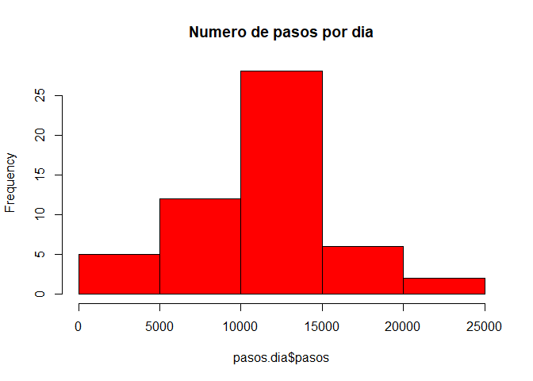
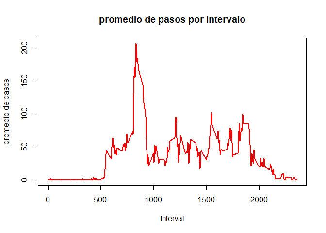
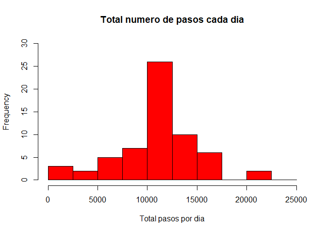
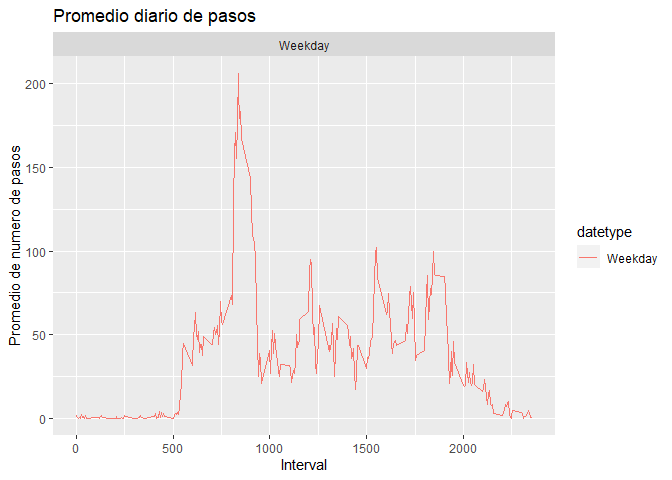

### Cargar paquetes
```{r}
pacman::p_load(haven, ggplot2, dplyr)
knitr::opts_chunk$set(warning=FALSE)
```

### cargar base de datos
```{r}
base<- read.csv("activity.csv")
```

### explorar base de datos
```{r}
head(base)
summary(base)

base$date <- as.Date(base$date)
```

## What is mean total number of steps taken per day?

### 1. Make a histogram of the total number of steps taken each day
```{r, results = 'asis'}

pasos.dia<-with(base, aggregate(steps, by = list(date), FUN=sum), na.rm=TRUE)
names(pasos.dia) <- c("date", "pasos")
hist(pasos.dia$pasos, main = "Numero de pasos por dia", col ="red")
```
 

### 2- Calculate and report the mean and median total number of steps taken per day
```{r}
mean(pasos.dia$pasos, na.rm=TRUE)
```
```{r}
median(pasos.dia$pasos, na.rm=TRUE)
```

## What is the average daily activity pattern?

### 1- Make a time series plot (i.e. type = "l") of the 5-minute interval (x-axis) and the average number of steps taken, averaged across all days (y-axis)
```{r, results = 'asis'}
promedio.diario <- aggregate(base$steps, by=list(base$interval), FUN=mean, na.rm=TRUE)
names(promedio.diario) <- c("interval", "mean")
plot(promedio.diario$interval, promedio.diario$mean, type = "l", col="red", lwd = 2, xlab="Interval", ylab="promedio de pasos", main="promedio de pasos por intervalo")
```
 
### 2- Which 5-minute interval, on average across all the days in the dataset, contains the maximum number of steps?
```{r}
promedio.diario[which.max(promedio.diario$mean), ]$interval
```

## Imputing missing values

### 1- Calculate and report the total number of missing values in the dataset (i.e. the total number of rows with NAs)
```{r}
sum(is.na(base$steps))
```

### 2- Devise a strategy for filling in all of the missing values in the dataset. The strategy does not need to be sophisticated. For example, you could use the mean/median for that day, or the mean for that 5-minute interval, etc.

```{r}
imputar.pasos <- promedio.diario$mean[match(base$interval, promedio.diario$interval)]
```

### 3- Create a new dataset that is equal to the original dataset but with the missing data filled in.
```{r}
base.input <- transform(base, steps = ifelse(is.na(base$steps), yes = imputar.pasos, no = base$steps))
total.pasos.input <- aggregate(steps ~ date, base.input, sum)
names(total.pasos.input) <- c("date", "pasosdiarios")
```

### 4- Make a histogram of the total number of steps taken each day and Calculate and report the mean and median total number of steps taken per day. Do these values differ from the estimates from the first part of the assignment? What is the impact of imputing missing data on the estimates of the total daily number of steps?
```{r, results = 'asis'}
hist(total.pasos.input$pasosdiarios, col = "red", xlab = "Total pasos por dia", ylim = c(0,30), main = "Total numero de pasos cada dia", breaks = seq(0,25000,by=2500))
```
 

#### 4.1 promedio de numero total de pasos por dia
```{r}
mean(total.pasos.input$pasosdiarios)
```

#### 4.2 mediana de numero total de pasos por dia
```{r}
median(total.pasos.input$pasosdiarios)
```

## Are there differences in activity patterns between weekdays and weekends?

### 1- Create a new factor variable in the dataset with two levels -- "weekday" and "weekend" indicating whether a given date is a weekday or weekend day.
```{r}
#separar en weekdays and weekend
base$date <- as.Date(strptime(base$date, format="%Y-%m-%d"))
base$datetype <- sapply(base$date, function(x) {
        if (weekdays(x) == "Sábado" | weekdays(x) =="Domingo") 
                {y <- "Weekend"} else 
                {y <- "Weekday"}
                y
        })
```

### 2- Make a panel plot containing a time series plot (i.e. type = "l") of the 5-minute interval (x-axis) and the average number of steps taken, averaged across all weekday days or weekend days (y-axis). The plot should look something like the following, which was created using simulated data:
```{r, results = 'asis'}
base.por.dia <- aggregate(steps~interval + datetype, base, mean, na.rm = TRUE)
g<- ggplot(base.por.dia, aes(x = interval , y = steps, color = datetype)) +
       geom_line() +
       labs(title = "Promedio diario de pasos", x = "Interval", y = "Promedio de numero de pasos") +
       facet_wrap(~datetype, ncol = 1, nrow=2)
print(g)
```
 

# Thanks!